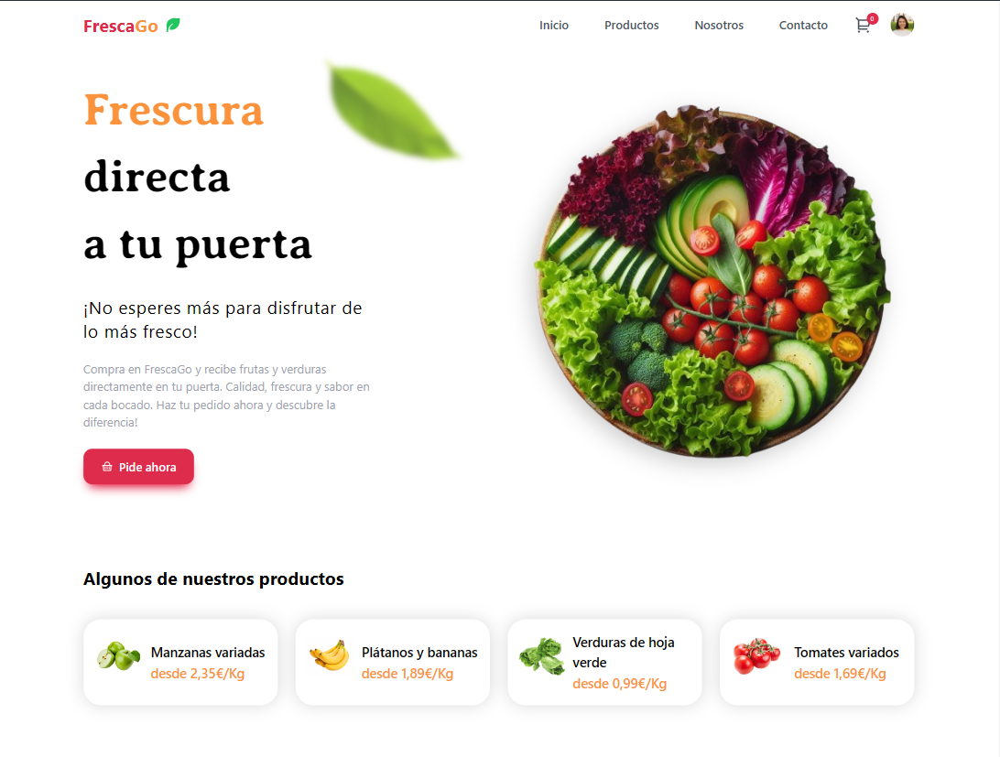
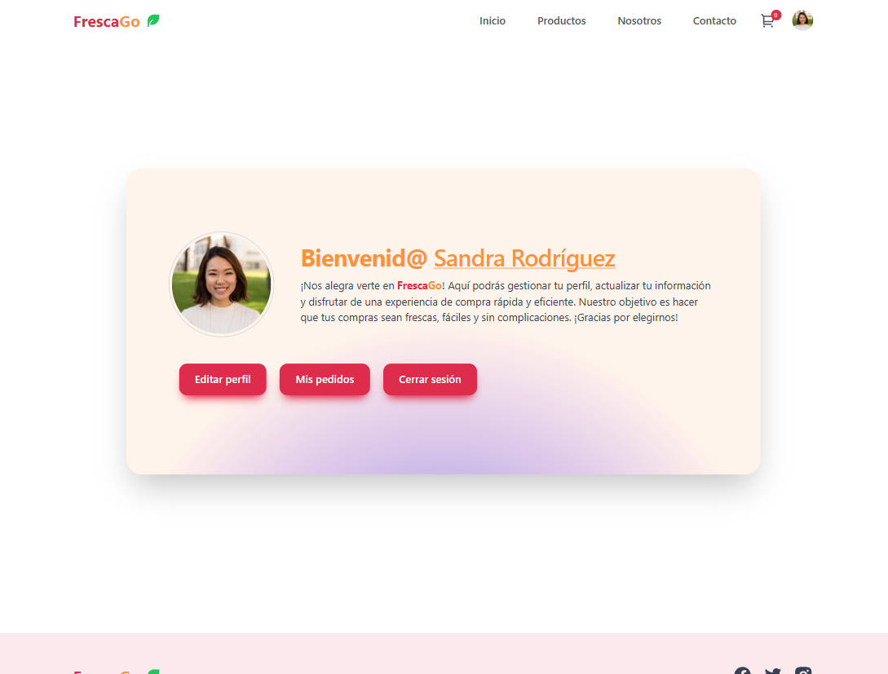
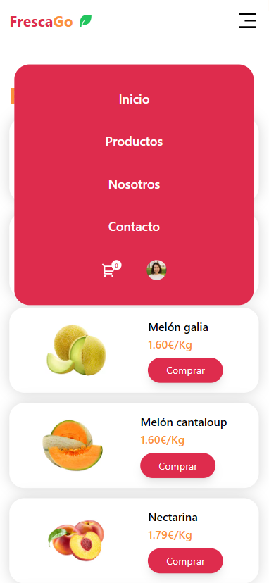

## FrescaGo 🍏 - E-commerce Platform

FrescaGo is a spanish modern e-commerce platform built using React, Tailwind CSS and Framer Motion for the frontend, Node.js and Express for the backend, Firebase for authentication and database, and Stripe for payment processing.

### ✨Features

- User Authentication with Firebase
- Product Listing
- Shopping Cart and Checkout
- Payment Integration with Stripe
- Order Management
- Responsive Design with Tailwind CSS

### 👩‍💻To initialize the project

- Clone the project from this repo
- Go into backend directory
- Make npm install and run npm start
- From the root directory go into frescaGo
- Make npm install and npm run dev to start
- Create firebase app and get the credentials
- Paste the firebase credentials on firebase.js in frescaGo
- Get stripe credentials and now you area good to go

### 🔒License

This project is licensed under the MIT License. See the LICENSE file for more information.

Now you are ready to launch FrescaGo! If you encounter any issues or have any questions, feel free to open an issue on the repository. Enjoy building and shopping with FrescaGo!
